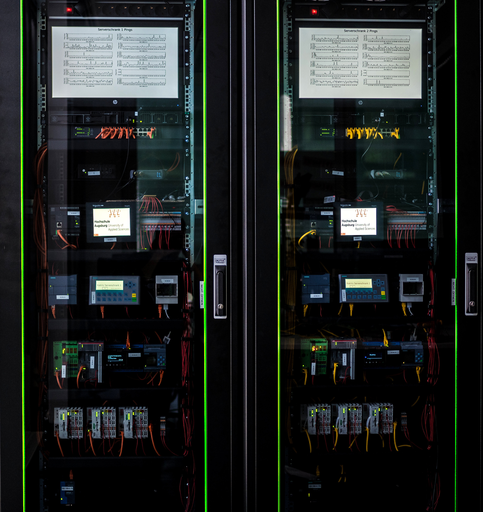

# macDetec - Device Identification by MAC Address

The software provided here serves as a PoC implementation.
The corresponding paper was presented at the ICS-CSR 2018.

<table align="center"><tr><td align="center" width="9999">
</img>
</td></tr></table>

## Abstract

Owing to a growing number of attacks, the assessment of Industrial Control Systems (ICSs) has gained in importance. An integral part of an assessment is the creation of a detailed inventory of all connected devices, enabling vulnerability evaluations. For this purpose, scans of networks are crucial. Active scanning, which generates irregular traffic, is a method to get an overview of connected and active devices. Since such additional traffic may lead to an unexpected behavior of devices, active scanning methods should be avoided in critical infrastructure networks. In such cases, passive network monitoring offers an alternative, which is often used in conjunction with complex deep-packet inspection techniques. There are very few publications on lightweight passive scanning methodologies for industrial networks. In this paper, we propose a lightweight passive network monitoring technique using an efficient Media Access Control (MAC) address-based identification of industrial devices. Based on an incomplete set of known MAC address to device associations, the presented method can guess correct device and vendor information. Proving the feasibility of the method, an implementation is also introduced and evaluated regarding its efficiency. The feasibility of predicting a specific device/vendor combination is demonstrated by having similar devices in the database. In our ICSi testbed, we reached a host discovery rate of 100% at an identification rate of more than 66%, outperforming the results of existing tools.

## Discovery

The device discoery is working completely passive with ARP requests broadcasted to the network.
From these broadcasts, the MAC address is used to look up devices with a similar MAC address in the database of macDetec.
If the found device is within a certrain range of a known device, it is likely that these devices are the same product.

## Vunlerability Mapping

With the above information a vulnerability mapping is done by querring the cve-details web API.

# Testbed
The testbed used for the evaluation can be seen in the following figure.

<table align="center"><tr><td align="center" width="9999">
</img>
</td></tr></table>

# Installation

Install libpcap-dev for the analyzis of network captures (pcap).
```zsh
sudo apt install libpcap-dev
```
Install all dependencies necessary to run macDetec.

```zsh
python3 -m pip install .
```

# Paper

The paper can be accessed over [BCS](https://ewic.bcs.org/content/ConWebDoc/59837).

@inproceedings{niedermaier2018efficient, <br>
&nbsp;&nbsp; title={Efficient Passive ICS Device Discovery and Identification by MAC Address Correlation}, <br>
&nbsp;&nbsp; author={Niedermaier, Matthias and Hanka, Thomas and Plaga, Sven and von Bodisco, Alexander and Merli, Dominik}, <br>
&nbsp;&nbsp; booktitle={5th International Symposium for ICS \& SCADA Cyber Security Research 2018 (ICS-CSR 2018)}, <br>
&nbsp;&nbsp; year={2018} <br>
} <br>
